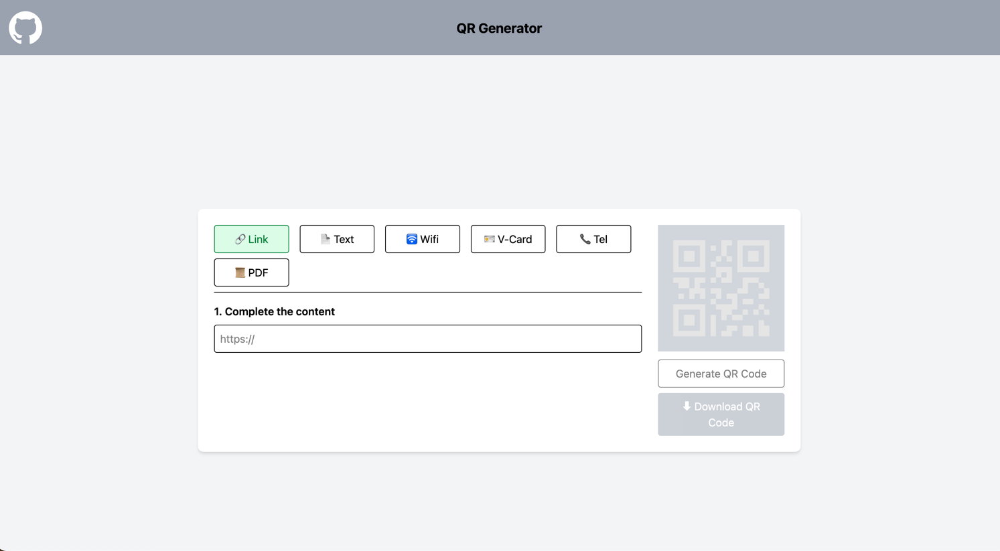

# QR Generator WEb

hello, everyone. this is one of the side project that 
generate qrCode as static or dynamic(with S3 resource)

[qr-generator-web](https://qrcode.freeapp.me/)





```angular2html
tar czvf secrets.tar.gz secret.yml
base64 -i secrets.tar.gz -o secrets_base64.txt
```
